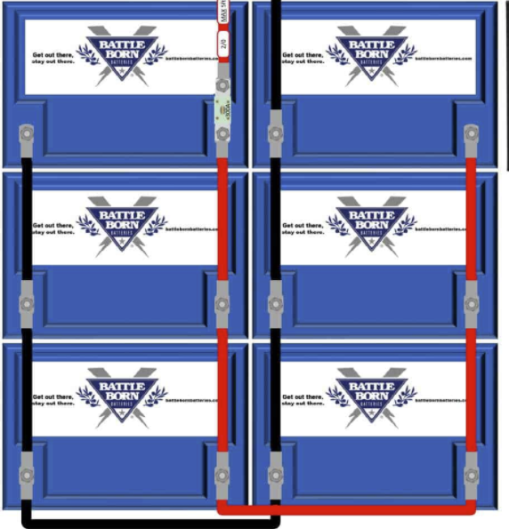

# Batteries
We have installed 6 Battle Born 12V 100Ah batteries.  The 6 batteries are connected in [parallel](https://en.wikipedia.org/wiki/Series_and_parallel_circuits).  

## Output
Our system outputs 12V DC Power at a capacity of 600Ah.

## Charging
The batteries are charged by either:
* [Solar](Solar.md)
* On Shore
### State of Charge
We installed Victron's [BMV-712 - Battery Monitor](https://battlebornbatteries.com/faq-all-about-bmvs/).

