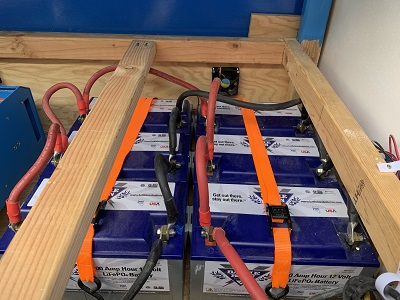

# Batteries
Perhaps obvious, the batteries in the van provide DC current to two loads:
- DC stuff like LED lights, a few fans...at most around 5 to 10A.
- DC to AC stuff through our inverter which requires enough current to power the 120V microwave, water heater, popcorn popper, and induction stove.  The inverter we are using can provide up to 3000W of 120V AC, roughly two of the AC appliances running at the same time.  Given this is a 12V system, 3000/12 = 250A max.  

Thus, the max amount of DC current delivered by the batteries at one time  is 250A.  

# Capacity

We have installed 6 Battle Born 12V 100Ah batteries.  The 6 batteries are connected in [parallel](https://en.wikipedia.org/wiki/Series_and_parallel_circuits).   Providing a capacity of 600Ah.



The BattleBorn batteries are designed to provide the high current (250A) requirements we need. [This battleborn blog post](https://battlebornbatteries.com/comparison-one-battle-born-lifepo4-battery-two-6v-gc2-batteries-series/) provides more detail into the battery's characteristics when used to supply current to higher current loads.

## Charging
The batteries are charged by either:
* [Solar](Solar.md)
* On Shore

The [Battle Born Manual](https://www.solar-electric.com/lib/wind-sun/Battle_Born_Manual.pdf) gives great info on the characteristics of these batteries.

DON'T UNDERSTAND THIS PARAGRAPH BECAUSE INVERTER ASKS FOR BETWEEN 100 and 200 A?

The BMS will not allow a current that exceeds 100 (+/- 5%) Amps for 30s, or 200 (+/- 10%) Amps for 0.5s.
Although these thresholds have been verified with a DC load bank, the 30 second high current threshold
may be reduced from 200A to around 150A for certain highly variable loads through an inverter – like a
microwave or space heater. After a high current disconnection, the battery will automatically reconnect
after 5 seconds.


### State of Charge
We installed Victron's [BMV-712 - Battery Monitor](https://battlebornbatteries.com/faq-all-about-bmvs/).  As noted in Victron's ["Energy Unlimited"](./documents/Book-Energy-Unlimited-EN.pdf) document: 

```
A battery monitor keeps track of the current flowing in and out of the battery. Integration of this current over time (which if the current would be a fixed amount of amps, boils down to multiplying current and time) gives the amount of amp-hours flowing in or out of the battery. For example: a discharge current of 10 A for 2 hours means that the battery has been discharged by
10 x 2 = 20 Ah.
```
...__To calculate Ah charge or discharge of a battery, a battery monitor only makes use of current and time__
