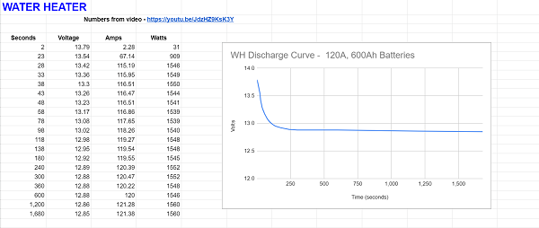
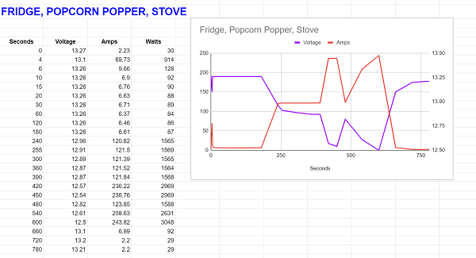

# Batteries
Perhaps obvious, the batteries in the van provide DC current to two loads:
- DC stuff like LED lights, a few fans...at most around 5 to 10A.
- DC to AC stuff through our inverter which requires enough current to power the 120V microwave, water heater, popcorn popper, and induction stove.  The inverter we are using can provide up to 3000W of 120V AC, roughly two of the AC appliances running at the same time.  Given this is a 12V system, 3000/12 = 250A max.  

Thus, the max amount of DC current delivered by the batteries at one time  is 250A.  

# Capacity

We have installed 6 Battle Born 12V 100Ah batteries. 

 The 6 batteries are connected in [parallel](https://en.wikipedia.org/wiki/Series_and_parallel_circuits).   Providing a capacity of 600Ah.

The BattleBorn batteries are designed to provide the high current (250A) requirements we need. [This battleborn blog post](https://battlebornbatteries.com/comparison-one-battle-born-lifepo4-battery-two-6v-gc2-batteries-series/) provides more detail into the battery's characteristics when used to supply current to higher current loads.
# Discharge
We installed Victron's [BMV-712 - Battery Monitor](https://battlebornbatteries.com/faq-all-about-bmvs/).

Below are the results of running a couple of tests of the inverter services high AC Watt loads. Running the appliances we will use in the van.
## Water Heater
Our first test turns on the Bosch 3000T water heater.  It takes roughly 30 minutes to completely heat up the water to what Bosch considers "ideal" temperature.

The battery voltage read:
- at start: 13.8V
- at end: 12.85V
- after a few minutes: 13.24V
## Fridge, Popcorn Popper, Induction Stove
Our fridge will run constantly.  On top of that, we expect to use high load appliances such as a popcorn popper and induction stove.

What happens when we run all three at the same time?

- There is an initial spike in power use (~ 914W) when the fridge is turned on.  After that, the inverter only needs between 6-7A from the batteries.  The voltage stays at around 13.26V.
- The next appliance that is turned on is a hot air popcorn popper.  The inverter now needs around 120A.  During the time the inverter is getting 120A, the voltage drops from 13.26V to 12.87V.
- The induction stove is plugged in while the fridge and popcorn popper are running.  Now the inverter is asking for around 240A, which is getting close to the 3000W/12V = 250A limit.  The voltage dropped to around 12.5V when the load was around 240A.
- When the loads were removed, the batteries reported a voltage of 13.21.

# Charging
The batteries are charged by either:
* [Solar](Solar.md)
* On Shore

(TBD: Not sure I need to point out more at this point. The Solar section documents the solar install).