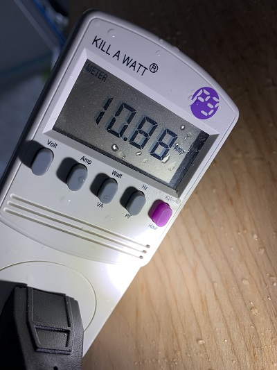
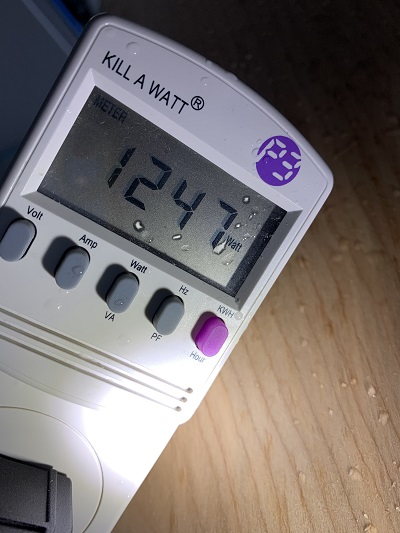
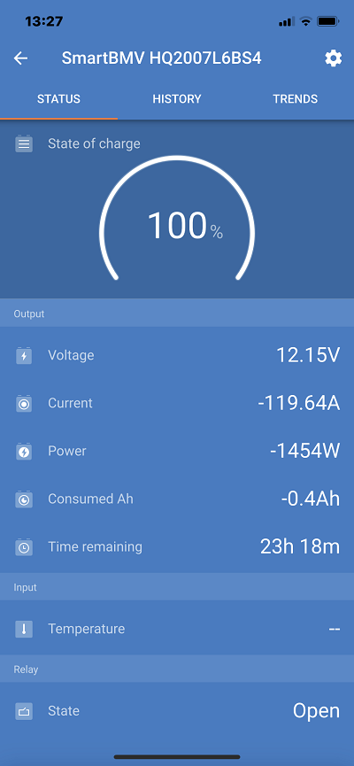

# Inverter and Hot Water Heater
We are using a Multiplus 12/3000/120-50 120v Inverter powered by Battleborn batteries that are showing 100% full (600Ah).

ISSUE: Approximately 15 secs after turning power on to our Bosch 3000 T water heater, the inverter flashes the low battery light, then the overload light flashes. The inverter stops working.

The BMV-712 iPhone app shows the amps/volts happening ([Video of what the iPhone app shows](https://youtu.be/63AJLNoMd2Y)):
- During a light load in which a few 12V LEAD lights on the ceiling of our van are on.
- when the water heater is plugged into an AC outlet.

__OVER 100A CURRENT DRAW?__
And then some because the amount of voltage is limited by 12V DC provided by the batteries.  Ohms law must be maintained.

A fully charged battery bank 

## Using Our Home Power
When the water heater is plugged into an extension cord that gets electricity from our house, the current draw is 10.88A.


The Power is 1247W



```
Watts = Volts * Amps
Volts = 1247 / 10.88 = 114.6V
```
This voltage value makes sense given our home is 110-120V AC.

While the water heater is plugged in and turned on, the SmartBMV software shows current = -120A, Power = -1454W.



```
Volts = 1454/119.64 = 12.15V
```
This voltage value also makes sense given the voltage source are the batteries.

I attribute the ```1454 - 1274 = 189W``` difference to other loads on the circuits (like DC lights), power drawn by components such as the inverter, waste that occurs during the transformation of 12V DC into 120V AC.


## Battle Born Help
Sent support request on 2/22/2021.  Reply:
```
Hey Margaret,

Thanks for the email.

Based on the description, it seems that you have a battery monitor issue. Could you provide the voltage of the battery bank to cross reference the percentage?
Thanks,
Aaron
775-622-3448
Ext 108
```
I provided Aaron with [a short video showing the BMV-712 UI on my iPhone](https://youtu.be/bfaY5cJxLmI) when the power was turned on with minimum load, i.e.: there were a few of the 12V overhead LED lights on.  Then the load increasing in current draw as I plugged our Dremmel into one of the AC plugs.  In my response mail I asked him: _As I understand what you are saying/asking, you want to make sure the battery monitor is showing the right values.  Correct?_

Aaron's follow up response:
```
Yes, that is correct. I just wanted to cross reference the percentage with voltage to ensure we are not dealing with any type of mismatch. Based on the video provided, batteries are at 13.76v and the BMV is 100%, so that checks out and can be eliminated. It is very common to see the majority of issues arise revolve  around a BMV-712. This is why I asked this question first, as it is the most common issue from a troubleshooting standpoint.
```


-- battery monitor issue:
- does the Inverter communicate with the battery monitor?  That doesn't make sense to me.  How does the inverter determine low battery?
- note in [Victron's video](https://youtu.be/UPfUn5ki7OM?t=235), the inverter is plugged directly into the battery (as it is in our Van).  So I get you are saying the battery monitor;s UI isn't right, but the batteries are working fine for everything else.  So that I understand, what you are asking is to make sure the battery monitor is showing the right values.  This means your assumption is the batteries are lower than needed to sustain the sine waves?


## Victron Forum
[My question](https://community.victronenergy.com/questions/78919/unexpected-inverter-overload.html?childToView=78922#answer-78922) received this response: 
```
rslifkin answered · 12 hours ago
What is the battery voltage doing leading up to the overload? And how big is the battery bank feeding the Multiplus?
```
Both replies point to the battery voltage.  Is it because it showed low battery?  That is peculiar.  Part of my issue is understanding exactly what is in Aaron's head.  I can start by plugging the water heater back in and then running it again.  This time with a movie being taken of battery monitoring. by doing a screen shot.  Will start there....

-- also check the install of the battery monitor - not working correctly?
-- also is the inverter talking to the battery monitor??????

