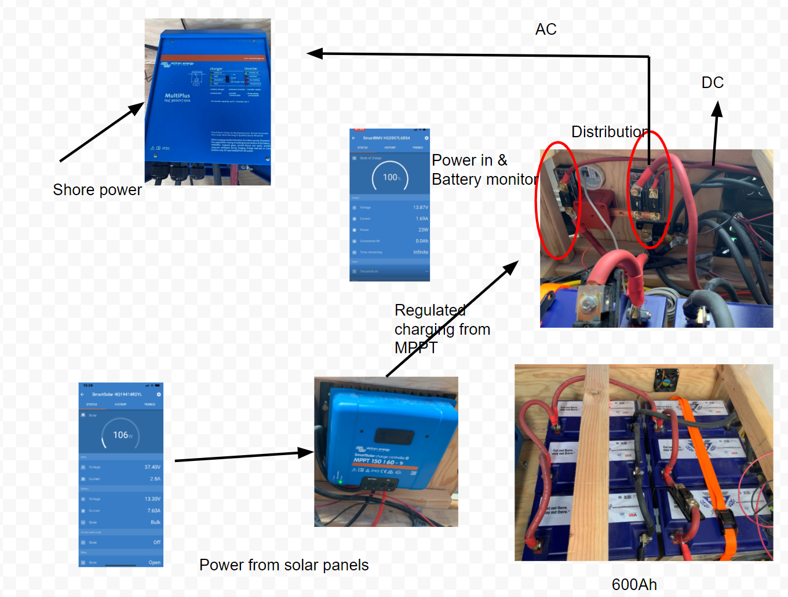
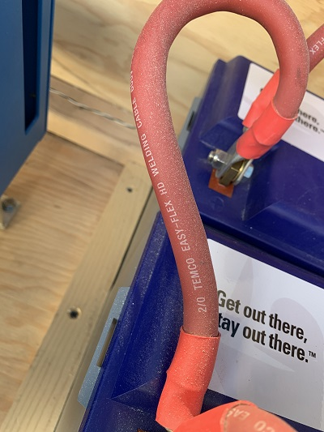
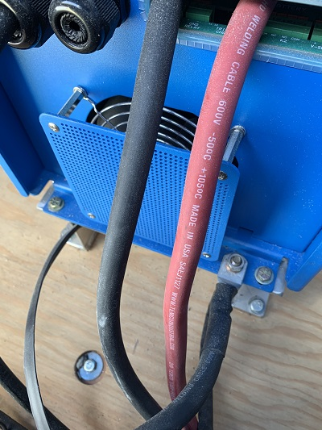
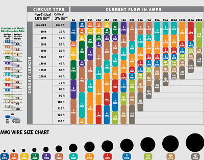

Our schematic is based heavily on [Nate Yarbrough's Explorist.life wiring diagram](./documents/explorist-life-3000w-inverter-1200w-solar-b2b-camper-van-wiring-diagram-20200718.pdf). 

______________________________________________
______________________________________________



_The image is a screenshot of  [a Google Draw document](https://docs.google.com/drawings/d/1X5Fls75ioN82ZMCHzN90oixNZ60E3s5VR6cbR8S1eH8/edit)_.

# Batteries
Six Battle Born 100Ah 12V batteries are connected in parallel providing 600Ah at 12V. 
## Wiring Between the Batteries
 [2/0 Gauge copper wire](https://amzn.to/2Mp7yia) is used to connect the batteries together.  If I was to start again, I would use 4/0 wiring as Nate has in his diagram.  More for peace of mind and simplicity.

As Nate pointed out to me in his private forum:  
__________________________________________________
_The wires BETWEEN THE BATTERIES will share the load, but the wires from the batteries to the busbar will take the full force of the load. So... Technically, the wires between the batteries can be smaller, but I don't do this on my diagrams as it simply introduces confusion and the 'how much smaller' question varies depending on how many batteries are in the battery bank. The VERYROUGH and basic way to figure that and figure: __Amps coming from battery bank / number of batteries = amps flowing from battery to battery__._

_But again... In my diagrams, I just match the wire sizes between batteries with the wire size from battery bank to busbars to keep it simple and remove all doubt._
___________________________________________________

Even at 400A, the current that flows __between__ batteries is roughly 400A/6 batteries = 67A.  Well within the range of 2/0 cable's [ampacity](https://www.cerrowire.com/products/resources/tables-calculators/ampacity-charts/).

# Wire and Fuses between Battery and Inverter
## Loads running at the same time
### AC
__The inverter will be the load that will require the maximum amount of current.__  To size the wire and fuse, we take in account:
* 2 1200W appliances at the same time (microwave, popcorn popper). _Note: Our other "large Amp pull" appliance is a [Bosch mini water heater](https://amzn.to/2PiUuvX).  We cannot run this if the other two appliances are being used_
* The inefficiency in the conversion of 12V DC to 120V AC by the inverter.  From Nate:
___________________________________________________
_The 'actual' inefficiencies are closer to 10%, but I always figure 20% just to be safe. The inefficiencies are also based on the type of device that is being powered and it's "Power Factor". This gets REALLY confusing REALLY quickly, so I just go with 20% as a safe margin._
___________________________________________________

```
W = V*A
A = W/V
A = (1200W + 1200W + .20(1200W + 1200W))/12V
A = 2880W/12V = 240A
```
___________________________________________________
### DC
I agree with Nate's comment:
___________________________________________________
_I rarely see DC usage over, say, 20A if ALL of the lights are on and I'm charging a few phones and the fans are going..._
___________________________________________________
## Maximum Amp Draw
Given 240A for AC and 20A for DC, __the total maximum Amp draw at any one time is expected to be 300A or less__.
## Cable Size
The cable from the batteries to the busbar needs to accommodate:
* 300A requirement.
* The Wire to busbar is < 6 feet (it's actually more like 2 feet...The point here is wire distance causes friction, which lowers voltage, which means less current can be supplied.  At the length of this cable, distance is not an issue)
* The temperature is within a reasonable range.  Here, our temperatures will be between 0 and 110 degrees F.

When I use [Nate's wire calculator](https://www.explorist.life/wire-sizing-calculator/) with A = 300A and distance = 4 feet, I get a wire size of 2/0.  So this should work.  This is what I started with.  I will change this.  It also recommends a fuse size of 450A, which seems large for a 2/0 300A..but makes sense when the calculation = 300 * 1.5 = 450A.

The batteries are (re)charged through:
* [solar](Solar.md)
* Shore power (that feeds into the [inverter](inverter.md))

The BMV-712 battery monitor is used to monitor the batteries.

The batteries provide power/electricity to both DC and AC circuits.

It's the AC circuits that "get exciting."  We use [Victrons Multiplus 12/3000/120-50 120v Inverter](inverter.md).

# Wire Size

The size of the wire must:
* Be able to carry the total amount of Amps that the loads will request at one time.
* The amount of resistance must not drop the voltage below what the loads require. _Note: [Nate (explorist.life) recommends at most a 3% voltage drop](https://youtu.be/ki3WXVR48eM?t=110)_.

## AMP Requirements
* The component that draws the most Amps at a time is the inverter.  The biggest current draw occurs when an appliance like a microwave, water heater, or popcorn popper are on.  The cable from the busbar to the inverter is at most 3 feet.
* We will not be running the microwave, water heater, or popcorn popper at the same time.
* The DC loads max at about 7A.  
* The only loads that are on continually are the LED lights, refrigerator (small AC), and components to maintain electricity (like the inverter and the solar battery charger).

## Choice of Wire Size

We chose [2/0 gauge copper cable](https://amzn.to/2Mp7yia).






We chose this size based on:
- We project our largest current draw to be 200A.
- By far the biggest user of current is the inverter.  The cable between the inverter and the busbar is at most 4 feet.  The rest of the current draws are in the 5 - 10A range.  We project at most two of these circuits will be active at one time, adding about 20A.
- The diameter of the cable is easier to work with than 3/0 or 4/0.

  

_Note: [Here is a higher resolution image of the cable diagram](./images/CurrentFlow_CableSize_Original.png)_

--TODO: FUSES...WHY THE SIZES THEY ARE AT? Why is there one in the batteries.

