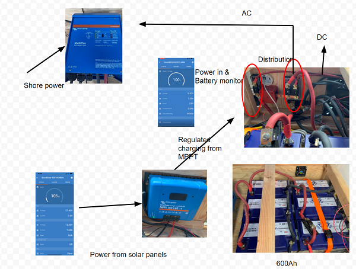

_The image is a screenshot of  [a Google Draw document](https://docs.google.com/drawings/d/1X5Fls75ioN82ZMCHzN90oixNZ60E3s5VR6cbR8S1eH8/edit)_.

Six Battle Born 100Ah 12V batteries are connected in parallel providing 600Ah at 12V.  [2/0 Gauge copper wire](https://amzn.to/2Mp7yia) is used to wire the batteries.

The batteries are (re)charged through:
* [solar](Solar.md)
* Shore power (that feeds into the [inverter](inverter.md))

The BMV-712 battery monitor is used to monitor the batteries.

The batteries provide power/electricity to both DC and AC circuits.

It's the AC circuits that "get exciting."  We use [Victrons Multiplus 12/3000/120-50 120v Inverter](inverter.md).

# Wire Size

We chose [2/0 gauge copper cable](https://amzn.to/2Mp7yia) based on our maximum expected load of current draw.
- the length of cable between components is always less than 6 feet.
- the amount of amps used at any one time should not be more than 30A.

--TODO: VERIFY CABLE BEING USED.

