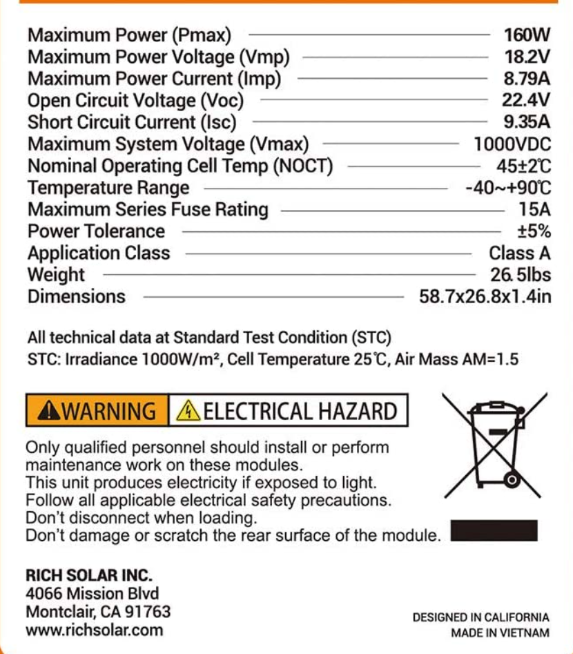
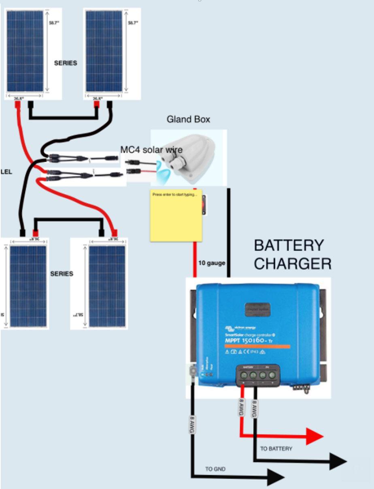
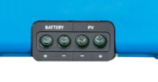
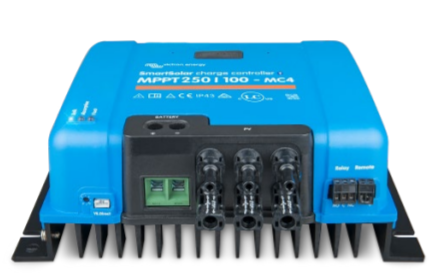
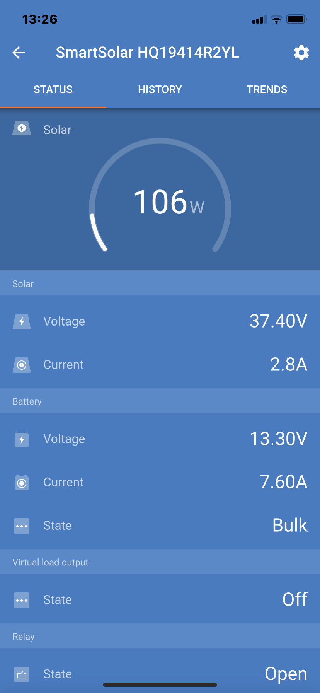

# Solar
## Panels

We installed 4 [RICH SOLAR 160 Watt 12 Volt Solar panels](https://amzn.to/37rtSPy) on Amazon.com (5/13/2020).

Each panel had the following characteristics:



Taking the numbers from the chart:
```
Watts = 18.2V * 8.79A * 4 panels = 639.9.
```
This makes sense since 160W * 4 = 640.  

Alas, the numbers given to us on the specs are maximum.  We assume to meet 12V and 8A per panel.
* Solar panels wired in series add voltage.
    * We have 4 12V panels, Two sets of two in series.   This means 24V goes into the charge controller.
* Solar panels wired in parallel add amps.
    * The two panels wired together in series are then wired together in paralell. At the point where the two sets are wired together, up to 16A (~ max) can go into the charge controller.  This means the gauge of our wire going in must be able to handle at least 16A.  The circuit breaker in the charge controller will prevent a fire in the (unlikely?) case a high amount of amps flow - which can happen in the case of a fault.

On the sunniest of sunniest days, with the mighty Sun directly above our panels, we might see 24V * 16A = 384W flowing into our battery charger.



### Installation

Nate in his video, [How to Wire Solar Panels in Series Parallel](https://youtu.be/b2H8vpj8rQg) walks us through how to do this.

  Unique "stuff" for installing the solar panels included:
* A mount for the top of the van that holds the panels.  This was custom made by a friend of ours.
* MC4 connectors on the ends of cables that are rugged enough and of the right gauge to handle being heavily exposed to the weather and can handle the current traveling through the copper wires in the cable.  We ended up buying a [Solar Panel Cable Wire "kit"](https://amzn.to/3kbmInG) that already had the MC4 connectors attached.
* a [Gland box](https://amzn.to/3qN3Iy0) that provides a waterproof way to get the wiring for the solar panels into the inside of the van.

By wiring in parallel, we have a level of redundancy.  One of the two can fail and the other will work.  Also, the amount of electricity put into the batteries will be more because the panels are not dependent on the panel that is most shaded.
## Battery Charge Controller
We are using a Victron 150/60 battery charger ([datasheet](https://cdn.shopify.com/s/files/1/0079/6003/5417/files/Datasheet-SmartSolar-charge-controller-MPPT-150-45-up-to-150-100-EN.pdf?111)).  Nate explains what a battery charge controller is in his [How to Size a Solar Charge Controller for a DIY Camper Van Solar System](https://youtu.be/MxziHKvTRh8?t=57).

__The goal of the battery charge controller is to regulate the incoming voltage from the solar panels to a nice smooth DC voltage required by our batteries.__  In our case, it goes from 24V to a smooth ~ 13.25V.

The max voltage input our battery charger can handle is 150V.  The max output amps is 60A.

Further on in Nate's video, he starts doing the math...hmm...

So we bought a battery charger that can more than fit the specs of our panels.
### Wiring
The battery charger has connection points for panel (PV) inputs and output.  


__*************************************************__


__TBD: NEED PICTURES OF HOW WE WIRED__

__*************************************************__





The output goes to the batteries.  Monitoring what is going on is done through Victron's app on our iPhone.



The screen shot was taken on a cloudy, rainy day.  At this point,
* Solar in: 106W.
```
37.4 * 2.8 = 104.72
```
Close enough to 106W to move on....
* Battery out: 13.3V at a current of 7.6A
* The battery charge state is Bulk

### Battery Charge State
How is the battery charger charging the batteries?  It depends on what state the charger is in.

Looking at the [UI's PDF](https://www.victronenergy.com/upload/documents/MPPT_Solar_Charge_Controllers/VictronConnect_-_MPPT_Solar_Charge_Controllers-en.pdf)  :

* __Bulk__: __During this stage the Controller delivers as much charge current as possible to rapidly charge the batteries.__ When the
battery voltage reaches the Absorption voltage setting, the Controller activates the Absorption stage.

* __Absorption__: __BATTERY CHARGING IS IN TOP OFF MODE__ During this stage the Controller switches to the constant voltage mode, where a pre-set absorption voltage, suitable to the battery type (See section 4.1 Battery Settings below), is applied. When the charge current decreases below the Tail
current and/or the pre-set Absorption time has elapsed, the battery is fully charged. The Controller switches to the Float
stage. The Tail current is 1A for models 100/20 and smaller; and 2A for larger models. (When an automatic equalisation is
being performed this will also be reported as 'Absorption'.)

* __Float__: __BATTERY IS FULLY CHARGED.__ During this stage the float voltage is applied to the battery to maintain a fully-charged state. When the battery voltage
drops below float voltage during at least 1 minute, a new charge cycle will be triggered.

* __Equalization__: __NOT SURE WE CARE__  This is shown when 'Start equalization now' is pressed in the battery settings. The charger applies the equalization voltage to the battery as long as the current level stays below 8% (Gel or AGM) or 25% (tubular plate) of the bulk current.


