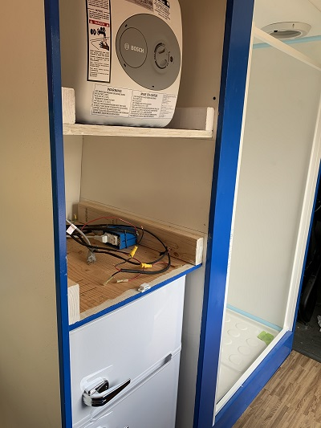
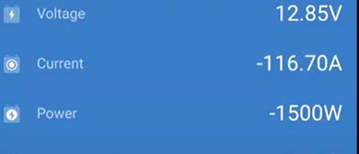
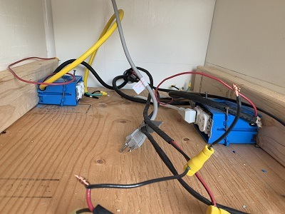

We have an (AC) appliance cabinet where the water heater, microwave, and refrigerator are located.

_Note: The microwave has been removed from the image so that we can work on the outlets._
# Appliance Power Characteristics
We measured the power consumption using the BMV-712 UI.
## Water Heater
The Water Heater is a Bosch 3000T.  The water heater requires the most power of any of the appliances when it is on heating water.

The voltage when there is no load is typically above 13.5V.  

Notice the [voltage discharge as the water is being heated](https://youtu.be/0e5vgFTGCzc).

## Induction Cooktop
The [Induction Cooktop](https://amzn.to/3b5QC9T)

## Microwave

## Popcorn Popper
# Wiring
The three appliances are plugged into wall warts located in a space between the fridge and microwave.  The shelf holding the microwave can be removed to allow us to work on the wiring to the plugs.

## Water Heater Plug
The water heater has a dedicated AC circuit. The plug closest to the wall of the van is wired for the water heater's power needs.

