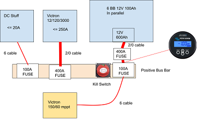

The busbar is based on [Nate's design](https://www.youtube.com/watch?v=qrZ-cr5qEwU).

This drawing is from a [Google Draw drawing](https://docs.google.com/drawings/d/1cFxG-SYLUrIibH9CmVWT-2lXVOBwTpq42evKXvPoeV0/edit).

 

I verified the drawing with Aaron at Dragonfly Energy on 3/4/2021.

On the positive side, a 2/0 cable with an inline "main" 400A fuse runs from the battery bank to the positive busbar.  I had a question about why the 400A fuse was needed if there were fuses for the inverter and DC loads.  I was not fully grasping that fuses protect the wires. Which means, every wire should have a fuse.  A challenge I was having was using poor quality fuses and fuse boxes.  Since then I am replacing fuses and fuse boxes with those from either:
- Blue Sea Systems
- Spartan Power

A note from Nate about the 400A "main" fuse that provided insight:

 _If the Inverter was running full tilt... that would be 250A and would not trip it's 400A fuse._

_If the 12V fuse block was running at, say, 80A: it would not trip it's 100A fuse._
_If the wires from the charge controller rubbed together and developed a VERY MINOR short circuit that was flowing 100A... that would not trip it's 150A fuse._

_and if something happened to the DC DC charger and shorted out internally, causing a mild short circuit of 40A... that's would not trip it's 60A fuse._

_That would be 470A flowing, which would trip the main system fuse._

_Although the chances of that particular scenario actually happening are slim to none...  that is why a main fuse is needed._

