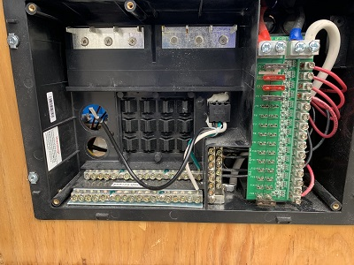
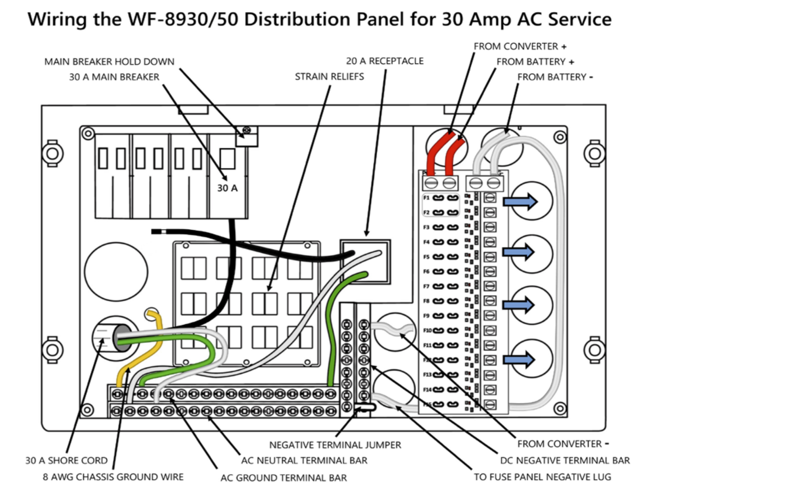

# Distribution Box
The distribution box manages the DC and AC circuits.  We have the [Arterra WF-8930/50NPB distribution "center"](https://wfcoelectronics.com/wp-content/uploads/2019/06/8930-50-Series-Manual-FINAL-web.pdf).

Here's an image of their wiring diagram.

## DC Circuits
The DC part is pretty easy.  The challenging part might be deciding what Fuses to use.  Our box has the following DC circuits:

## AC Circuits
The wiring diagram has "30A Shore cord" coming into the 30 A main breaker.  Our "cord" is the AC OUT from the [inverter](inverter.md) (i.e.: AC OUT from the inverter is AC in for the distribution box).  Now that we have AC IN, we can start wiring the other circuits.  

The main breaker is a 30A SQUARE-D HOM One-Pole circuit breaker.  We use SQUARE-D HOM TANDEM circuit breakers for the AC circuits to the Van's appliances.  This way, we can have up to six AC circuits.

