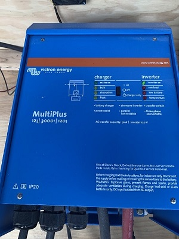
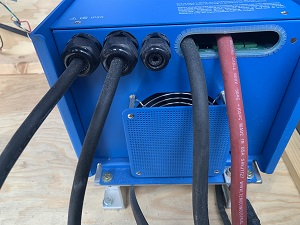

# The Inverter
The job of the inverter is to take in DC Current and convert it to AC current.  This way, we can run appliances we typically run in our house - like a microwave, popcorn popper, etc.
## Inverter Model
We are using a [Victron Multiplus 12/3000/120-50 120v Inverter](https://www.victronenergy.com/upload/documents/Manual%20-%20MultiPlus%203k%20120V%20Ve.Bus%20enabled%20-%20rev%2000%20-%20EN.pdf).

* [Victron Explaining how the AC Sine Wave is generated](https://youtu.be/UPfUn5ki7OM?t=143).  The Sine Wave that is created with the 12V in is about 10V.  The inverter uses a transformer to bump the wave up to 120V.

Notice the wiring:

## Inverter Charger
This model of inverter also supports the ability of recharging our batteries using shore power. 

## Cables

### DC IN
The Red and Black Cables on the right connect to the batteries.  These cables provide the 12V DC power into the inverter.

### AC OUT
The two connectors closest to the Red and Black cables are for AC Output.  The image points out we are only using one of the lines.  We'd have to open the lid, but we should be using what Victron calls "AC-OUT 1 in their ["How to Install" document](https://www.victronenergy.com/blog/2020/10/30/how-to-install-a-multiplus-inverter-charger/).  If we weren't we wouldn't get any power, as noted below from thier document:

 _AC Output 1 is the main output.  It supplies power regardless of whether shore or generator power is available or not and is the output on which the ‘PowerAssist’ feature is available. PowerAssist adds battery power to an AC source (shore or generator for example) when the on-board power demand would otherwise exceed the available current limit. AC Output 2 is only live when the MultiPlus is connected to an external AC source (eg. shore or generator). The thinking here is that by using AC Output 2 for non essential loads like water heaters, you’ll never accidentally drain the batteries if the generator or shore power fails._

 ### AC IN
 The cable to the far left is input from Shore Power.

 ## Debugging
 * [User Manual](https://www.victronenergy.com/upload/documents/User-Manual-MultiPlus-3k-120V-(firmware-xxxx4xx)-EN-ES.pdf)
 * [Service Manual](https://www.victronenergy.com/upload/documents/Service-Manual-MultiPlus-3k-120V-(firmware-xxxx4xx)-EN-ES.pdf)
 * [Overload webinar](https://www.youtube.com/watch?v=4SXtGIx0x5w)

