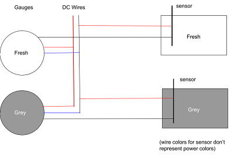

We are using two water level gauges:
- a [white one](https://amzn.to/3bXYjhK) for monitoring our fresh water level.
- a [black one](https://amzn.to/3qhPCUk) for monitoring our grey water level.
And [two water level sensors](https://amzn.to/3qlBucF)

We used these after watching [Van Tourist's YouTube video _Coolest water level gauges and sensors for RV or marine_](https://youtu.be/NU4aUmiEbMg)

# Wiring Schematic
The wiring is as follows

I used the same wires that I used for wiring DC.  This is why the sensor has a red and black wire instead of some other color combo.  I used the red wire from the sensor to be GND and the black wire to connect to the gauge's black wire - which is actually the sensor wire.  Just a bit confusing I guess....