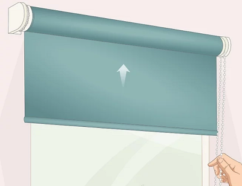
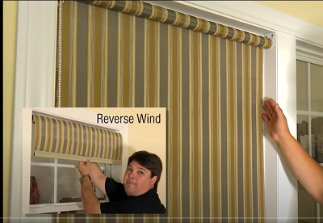
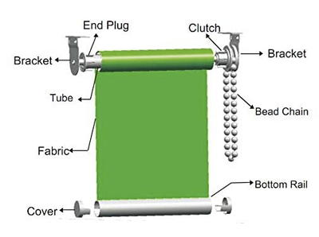

# The Window shade
We put in a view window:

## Dimensions

## Our Requirements
* The window cover __enhances the overall theme and happiness__ when we walk into the van.  We chose colors that are common to the Greek Isles.  The window cover must capture the spirit of relaxing and exploring the Greek isle of Mykonos.
* Is made with a high quality fabric that is not scratchy to the touch.
* Easily opens and closes.
* Stays open when opened.  Closed when closed.
* Does not distract from viewing out of the window.
* Prevents people looking in when closed.
* (nice to have) Provides a level of insulation..

## Options for a curtain/shade
There are several ways a window can be covered.  Options include Roman shades, curtains that open from the middle, shades that roll down from the top, panels that stick to the window...
### Roll Down Shades
As I was sitting looking out the window, the roller down shade popped into my head as perhaps the direction to go.

_Note: As pointed out in [this video](https://youtu.be/g3gb1zHDBuM?t=77), a choice needs to be made between using a regular or reverse wind_.

It would seem regular wind would provide a better blackout experience...but...

#### DIY Roll Down Shades

It appears fairly easy to make our own roll down shades.  The YouTube video [How To Recycle Roller Blinds DIY | The Carpenter's Daughter](https://youtu.be/RvR02es0_-I) goes through the steps.

We need:
* Dual sided __fabric__.  One side is the fabric with the image Vera designed for us.  The other side is a thinsulate (like?) fabric.  _Note: Besides Spoonflower, https://ripstopbytheroll.com  might be a fabric and sewing source.  We ended up buying pre-made front windows from a similar DIY company that focused on providing a "custom fitting" like this one would be._
* A readily available [roller blind clutch with end brackets](https://amzn.to/3pNXCfT).
* A tube the fabric rolls up on.  The clutch seems to be typically 1 1/4".  We can get [10' of 1 1/4" ID PVC tube at Home Depot for $6](https://www.homedepot.com/p/JM-EAGLE-1-1-4-in-x-10-ft-PVC-Sch-40-DWV-Plain-End-Pipe-1586/100147742).
* A bottom piece of wood at the bottom of the shade so that there is weight to hold the shade.
* _TBD: Snaps or hooks on the sides and bottom to further block out the window_

